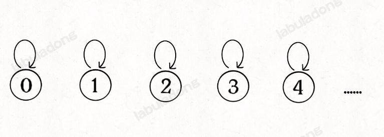
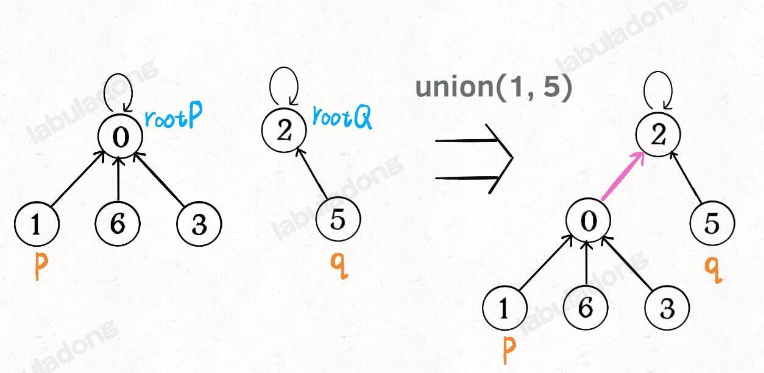
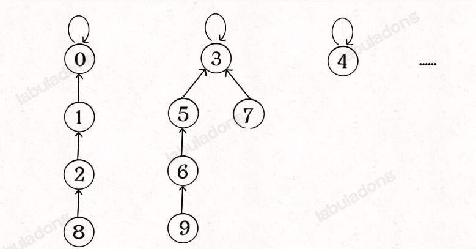
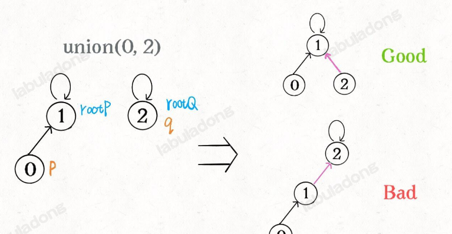
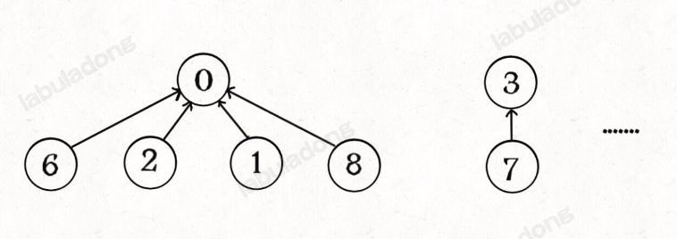

# 并查集 Union-Find

Union-Find常用于查看连通性，也是比较高频的题目。

## 算法介绍

现在我们的 Union-Find 算法主要需要实现这两个 API：

```java
class UnionFind {
    /* 将 p 和 q 连接 */
    public void union(int p, int q);
    /* 判断 p 和 q 是否连通 */
    public boolean connected(int p, int q);
    /* 返回图中有多少个连通分量 */
    public int count();
}
```

对于一个图中的两个节点p和q，如果这两个节点之间有一条边，或者通过一个或多个节点相连，我们认为这两个节点是联通的，`connected(p, q)`就会返回true，否则返回false。`union(p, q)`则是将p和q联通起来，如果p和q原来不是联通的，联通之后，连通分量就会-1。

可以看出，这个算法的重点在于如何实现`union`和`connected`函数。

### 基本实现

我们假设每个节点都有一个指针指向父节点，如果是根节点的话，就指向自己，对于一个图来说，一开始每个节点都指向自己。

<figure><figcaption></figcaption></figure>

用代码实现是这样的:

```java
class UF {
    // 记录连通分量
    private int count;
    // 节点 x 的父节点是 parent[x]
    private int[] parent;

    /* 构造函数，n 为图的节点总数 */
    public UF(int n) {
        // 一开始互不连通
        this.count = n;
        // 父节点指针初始指向自己
        parent = new int[n];
        for (int i = 0; i < n; i++)
            parent[i] = i;
    }

    /* 其他函数 */
}
```

如果两个节点被联通，那么让其中一个节点的根节点指向另一个节点的根节点

<figure><figcaption></figcaption></figure>

代码实现如下

```java
class UF {
    public void union(int p, int q) {
        int rootP = find(p);
        int rootQ = find(q);
        if (rootP == rootQ)
            return;
        // 将两棵树合并为一棵
        parent[rootP] = rootQ;
        // parent[rootQ] = rootP 也一样
        count--; // 两个分量合二为一
    }

    /* 返回某个节点 x 的根节点 */
    private int find(int x) {
        // 根节点的 parent[x] == x
        while (parent[x] != x)
            x = parent[x];
        return x;
    }

    /* 返回当前的连通分量个数 */
    public int count() { 
        return count;
    }
}

```

此时，如果p和q是联通的，那么他们一定有相同的根节点

```java
class UF {
    public boolean connected(int p, int q) {
        int rootP = find(p);
        int rootQ = find(q);
        return rootP == rootQ;
    }
}

```

这样，Union-Find就基本完成了，看似复杂的问题，其实可以通过模拟一个指向根节点的指针数组来完成。那么时间复杂度是多少呢？我们发现，主要 API `connected` 和 `union` 中的复杂度都是 `find` 函数造成的，所以说它们的复杂度和 `find` 一样。

`find` 主要功能就是从某个节点向上遍历到树根，其时间复杂度就是树的高度。我们可能习惯性地认为树的高度就是 `logN`，但这并不一定。`logN` 的高度只存在于平衡二叉树，对于一般的树可能出现极端不平衡的情况，使得「树」几乎退化成「链表」，树的高度最坏情况下可能变成 `N`。

<figure><figcaption></figcaption></figure>

所以说上面这种解法，`find` , `union` , `connected` 的时间复杂度都是 O(N)。这个复杂度很不理想的，你想图论解决的都是诸如社交网络这样数据规模巨大的问题，对于 `union` 和 `connected` 的调用非常频繁，每次调用需要线性时间完全不可忍受。

那么怎么优化这个算法呢？

### 平衡性优化

不平衡的现象主要发生在union的过程中，我们简单粗暴的把一个节点所在的树接到另一个树的根节点的下面，可能会出现不平衡的现象。

<figure><figcaption></figcaption></figure>

这样下去，可能会出现非常不平衡的情况。我们可以让较小的树接到较大的树下面，这样可以避免不平衡的问题，解决方法是额外使用一个 `size` 数组，记录每棵树包含的节点数。

```java
class UF {
    private int count;
    private int[] parent;
    // 新增一个数组记录树的“重量”
    private int[] size;

    public UF(int n) {
        this.count = n;
        parent = new int[n];
        // 最初每棵树只有一个节点
        // 重量应该初始化 1
        size = new int[n];
        for (int i = 0; i < n; i++) {
            parent[i] = i;
            size[i] = 1;
        }
    }
    /* 其他函数 */
}
```

同时我们需要修改一下union方法

```java
class UF {
    public void union(int p, int q) {
        int rootP = find(p);
        int rootQ = find(q);
        if (rootP == rootQ)
            return;
        
        // 小树接到大树下面，较平衡
        if (size[rootP] > size[rootQ]) {
            parent[rootQ] = rootP;
            size[rootP] += size[rootQ];
        } else {
            parent[rootP] = rootQ;
            size[rootQ] += size[rootP];
        }
        count--;
    }
}

```

这样树的高度大致是 `logN` 这个数量级，极大提升执行效率。

### 路径压缩

让我们回顾一下这个算法的用处，是判断两个节点是否有相同的根节点，我们实际上并不在乎树的结构，我们只在乎根节点。既然这样，我们能不能压缩每棵树的高度，让树高始终是常数？

<figure><figcaption></figcaption></figure>

这样每个节点的父节点就是它的根节点，`find` 就能以 O(1) 的时间找到某一节点的根节点，相应的，`connected` 和 `union` 复杂度都下降为 O(1)。而这个技巧实际上很容易实现，

```java
class UF {
    public int find(int x) {
        if (parent[x] != x) {
            // 递归的去寻找根节点
            parent[x] = find(parent[x]);
        }
        return parent[x];
    }
}
```

如果我们使用了路径压缩的技巧，那么平衡其实就不是非常需要了，所以一般的Union-Find的实现如下：

```java
class UF {
    // 连通分量个数
    private int count;
    // 存储每个节点的父节点
    private int[] parent;

    // n 为图中节点的个数
    public UF(int n) {
        this.count = n;
        parent = new int[n];
        for (int i = 0; i < n; i++) {
            parent[i] = i;
        }
    }
    
    // 将节点 p 和节点 q 连通
    public void union(int p, int q) {
        int rootP = find(p);
        int rootQ = find(q);
        
        if (rootP == rootQ)
            return;
        
        parent[rootQ] = rootP;
        // 两个连通分量合并成一个连通分量
        count--;
    }

    // 判断节点 p 和节点 q 是否连通
    public boolean connected(int p, int q) {
        int rootP = find(p);
        int rootQ = find(q);
        return rootP == rootQ;
    }

    public int find(int x) {
        if (parent[x] != x) {
            parent[x] = find(parent[x]);
        }
        return parent[x];
    }

    // 返回图中的连通分量个数
    public int count() {
        return count;
    }
}

```

Union-Find 算法的复杂度可以这样分析：构造函数初始化数据结构需要 O(N) 的时间和空间复杂度；连通两个节点 `union`、判断两个节点的连通性 `connected`、计算连通分量 `count` 所需的时间复杂度均为 O(1)。

## 题目举例

### [leetcode323](https://leetcode.com/problems/number-of-connected-components-in-an-undirected-graph/description/)

这道题是非常基本的并查集问题，可以直接套用UnionFind类来解决。

```java
class Solution {
    public int countComponents(int n, int[][] edges) {
        UnionFind uf = new UnionFind(n);
        for (int[] edge : edges) {
            uf.union(edge[0], edge[1]);
        }
        return uf.count;
    }

    class UnionFind {
        int[] parents;
        int count;

        public UnionFind(int n) {
            count = n;
            parents = new int[n];
            for (int i = 0; i < n; i++) {
                parents[i] = i;
            }
        }

        int find(int i) {
            if (i != parents[i]) {
                parents[i] = find(parents[i]);
            }
            return parents[i];
        }

        void union(int p, int q) {
            int rootP = find(p);
            int rootQ = find(q);
            if (rootQ == rootP) return;
            parents[rootP] = rootQ;
            count--;
        }
    }
}
```
