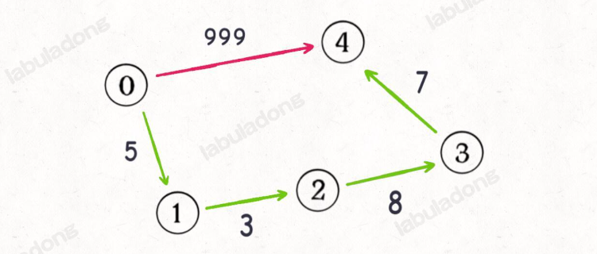
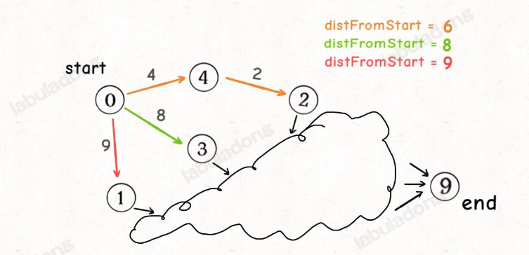

# Dijkstra 算法

Dijkstra 算法主要用于寻找一个加权图中寻找一个节点到另一个节点的最短路径，看上去很复杂，其本质上就是贪心+BFS。

## BFS算法

BFS的算法框架如下：

```java
// 输入起点，进行 BFS 搜索
int BFS(Node start) {
    Queue<Node> q; // 核心数据结构
    Set<Node> visited; // 避免走回头路
    
    q.offer(start); // 将起点加入队列
    visited.add(start);

    int step = 0; // 记录搜索的步数
    while (q not empty) {
        int sz = q.size();
        /* 将当前队列中的所有节点向四周扩散一步 */
        for (int i = 0; i < sz; i++) {
            Node cur = q.poll();
            printf("从 %s 到 %s 的最短距离是 %s", start, cur, step);

            /* 将 cur 的相邻节点加入队列 */
            for (Node x : cur.adj()) {
                if (x not in visited) {
                    q.offer(x);
                    visited.add(x);
                }
            }
        }
        step++;
    }
}

```

这个算法用于无权图，也就是每条边的权重都是1，从起点到终点的路径长度就是经过的边的数量。但是对于加权图来说，每条边的权重就不是1了，可以是任意正数，如下图

<figure><figcaption></figcaption></figure>

我们需要根据权重对上面的BFS算法进行修改，我们不能再一层一层地向外扩散，因为边的数量没有意义了，路径的权重之和才有意义。

## Dijkstra算法框架

标准的Dijkstra算法输入是一个图和一个起点，要返回起点到达图中的所有点最短路径。而在题目中，更多出现的是一个点到另一个点的最短路径，在标准版本上稍作修改即可。

函数的签名如下：

```java
// 输入一幅图和一个起点 start，计算 start 到其他节点的最短距离
int[] dijkstra(int start, List<Integer>[] graph);
```

同时我们需要一个State类来辅助算法：

```java
class State {
    // 图节点的 id
    int id;
    // 从 start 节点到当前节点的距离
    int distFromStart;

    State(int id, int distFromStart) {
        this.id = id;
        this.distFromStart = distFromStart;
    }
}
```

我们需要这个类来保存一个节点到起点的距离。在BFS中，我们用visited函数来保证不会重复访问，因为我们第一次访问到某个节点就是到达这个节点的最短路径。而在加权图中，一个节点可能会被访问很多次，因为第一次到达这个节点时并不一定是最短路径。

下面我们来看一下算法模板：

```java
// 返回节点 from 到节点 to 之间的边的权重
int weight(int from, int to);

// 输入节点 s 返回 s 的相邻节点
List<Integer> adj(int s);

// 输入一幅图和一个起点 start，计算 start 到其他节点的最短距离
int[] dijkstra(int start, List<Integer>[] graph) {
    // 图中节点的个数
    int V = graph.length;
    // 记录最短路径的权重，你可以理解为 dp table
    // 定义：distTo[i] 的值就是节点 start 到达节点 i 的最短路径权重
    int[] distTo = new int[V];
    // 求最小值，所以 dp table 初始化为正无穷
    Arrays.fill(distTo, Integer.MAX_VALUE);
    // base case，start 到 start 的最短距离就是 0
    distTo[start] = 0;

    // 优先级队列，distFromStart 较小的排在前面
    Queue<State> pq = new PriorityQueue<>((a, b) -> {
        return a.distFromStart - b.distFromStart;
    });

    // 从起点 start 开始进行 BFS
    pq.offer(new State(start, 0));

    while (!pq.isEmpty()) {
        State curState = pq.poll();
        int curNodeID = curState.id;
        int curDistFromStart = curState.distFromStart;

        if (curDistFromStart > distTo[curNodeID]) {
            // 已经有一条更短的路径到达 curNode 节点了
            continue;
        }
        // 将 curNode 的相邻节点装入队列
        for (int nextNodeID : adj(curNodeID)) {
            // 看看从 curNode 达到 nextNode 的距离是否会更短
            int distToNextNode = distTo[curNodeID] + weight(curNodeID, nextNodeID);
            if (distTo[nextNodeID] > distToNextNode) {
                // 更新 dp table
                distTo[nextNodeID] = distToNextNode;
                // 将这个节点以及距离放入队列
                pq.offer(new State(nextNodeID, distToNextNode));
            }
        }
    }
    return distTo;
}
```

相较于普通的BFS算法，这个算法有以下不同点：

**1. 不需要visited数组**

为什么没有visited数组也不会死循环呢？我们看一下我们是怎么加入节点和取出节点的，在每一轮循环中，我们都会取出一个节点，但是我们并不是每一轮都会存入一个节点，只有当我们发现了一条更短的路径，我们才会存入这个节点。**由于两个节点的最短距离是一个确定值，不可能永远减小下去，所以最后队列一定会为空。**

**2. 使用优先队列而不是普通队列**

当然可以使用普通队列，但是效率不够高。Dijkstra算法利用优先队列每次队首都是最小的值这个特点，**类似于贪心算法**。比方说下面这个情况：

<figure><figcaption></figcaption></figure>

假如我们遍历到了图中的这些点，这三条路径都可能是最短路径的一部分，但是橙色成为最短路径的可能性更大，所以我们希望每次拿出最短的路径，从这个路径开始向下遍历。这时候，优先队列的效率就比较高了。


如果我们只关心起点到一个终点的最短路径，如何简化这个算法呢？


其实很简单，因为优先队列始终会弹出当前的最短路径，第一次到达终点的时候，就一定是最短路径，直接返回即可

```java
// 输入起点 start 和终点 end，计算起点到终点的最短距离
int dijkstra(int start, int end, List<Integer>[] graph) {

    // ...

    while (!pq.isEmpty()) {
        State curState = pq.poll();
        int curNodeID = curState.id;
        int curDistFromStart = curState.distFromStart;

        // 在这里加一个判断就行了，其他代码不用改
        if (curNodeID == end) {
            return curDistFromStart;
        }

        if (curDistFromStart > distTo[curNodeID]) {
            continue;
        }

        // ...
    }

    // 如果运行到这里，说明从 start 无法走到 end
    return Integer.MAX_VALUE;
}
```

### 时间复杂度分析

通常来说是 `O(ElogV)`，其中 `E` 代表图中边的条数，`V` 代表图中节点的个数。

因为理想情况下优先级队列中最多装 `V` 个节点，对优先级队列的操作次数和 `E` 成正比，所以整体的时间复杂度就是 `O(ElogV)`。

但是实际上不同的实现方法和不同语言的API会有不同的时间复杂度，由于我们的算法中使用了优先队列，队列中最多会存在`E`个节点，因此时间复杂度是 `O(ElogE)`

## 题目举例

### [leetcode743](https://leetcode.com/problems/network-delay-time/description/)

这题要求到达所有节点的最短距离，实际上就是问从起点到所有点的最短路径，是最标准的Dijkstra算法，直接套用框架，代码如下

```java
class Solution {
    public int networkDelayTime(int[][] times, int n, int k) {
        // 利用times构建图，起点=>[终点，距离]
        Map<Integer, Set<int[]>> map = new HashMap<>();
        for (int[] time : times) {
            int u = time[0], v = time[1], w = time[2];
            map.putIfAbsent(u, new HashSet<>());
            map.get(u).add(new int[]{v, w});
        }
        // 优先队列，保存[节点，到起点的距离]每次抛出当前最短路径
        PriorityQueue<int[]> pq = new PriorityQueue<>((a, b) -> a[1] - b[1]);
        // 起点的距离是0
        pq.add(new int[]{k, 0});
        // 最短路径长度数组
        int[] dist = new int[n + 1];
        Arrays.fill(dist, Integer.MAX_VALUE);
        // 起点的距离是0
        dist[k] = 0;
        while (!pq.isEmpty()) {
            int[] poll = pq.poll();
            int curNode = poll[0], curDist = poll[1];
            // 查看相邻节点
            if (map.containsKey(curNode)) {
                for (int[] next : map.get(curNode)) {
                    int nextNode = next[0], nextDist = next[1] + curDist;
                    // 只有距离变小的时候，加入节点
                    if (nextDist < dist[nextNode]) {
                        dist[nextNode] = nextDist;
                        pq.add(new int[]{nextNode, nextDist});
                    }
                }
            }
        }
        // 遍历距离数组，其中的最大值就是到达全部节点的最小时间
        int res = 0;
        for (int i = 1; i <= n; i++) {
            if (dist[i] == Integer.MAX_VALUE) return -1;
            res = Math.max(res, dist[i]);
        }
        return res;
    }
}
```
