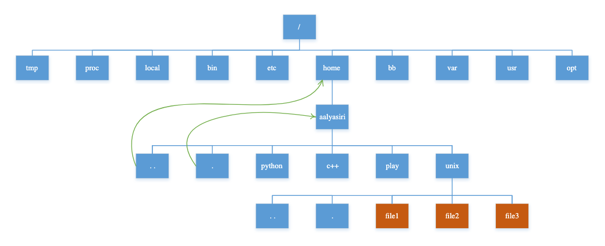

# 环检测和拓扑排序

拓朴排序和有向图的环检测是比较常见的图算法，可以先看一下这个[链接](https://www.bilibili.com/video/BV1uf4y1U7DX/?vd\_source=2cdcfec5d7a551bef0c23320aea32803)的解释。而本质上，有向图的环检测就可以通过拓扑排序来检查，所以这里只介绍拓扑排序，当然还有别的环检测算法，会在后面提及。

对于拓扑排序而言，DFS和BFS都是可以解决的，但是BFS相对而言更好理解，并且写法上更加简洁。

## 拓扑排序

<figure><figcaption></figcaption></figure>

拓扑排序如图所示，简单地说，就是把一个图拉平，在这个拉平的图中，所有箭头的方向都是一致的。如果一个图中存在环，那么这个图是肯定不能进行拓扑排序的，因为不能保证所有箭头的方向都是一致的。

那么如何用BFS来实现拓扑排序呢？具体分为以下步骤：

1. 利用HashMap等结构创建图，保存图中的依赖关系
2. 构建一个数组来记录每个节点的入度，即多少个节点指向它
3. 将入度为0的节点存入BFS的队列中
4. 进行BFS循环，不断弹出节点，减少相邻节点的入度，并且将入度为0的节点存入队列
5. 如果所有节点都被遍历过，说明不存在环，否则说明存在环

下图解释这个算法，节点中的数字代表该节点的入度：


队列进行初始化后，入度为 0 的节点首先被加入队列：


开始执行 BFS 循环，从队列中弹出一个节点，减少相邻节点的入度，同时将新产生的入度为 0 的节点加入队列：


继续从队列弹出节点，并减少相邻节点的入度，这一次没有新产生的入度为 0 的节点：


继续从队列弹出节点，并减少相邻节点的入度，同时将新产生的入度为 0 的节点加入队列：


继续弹出节点，直到队列为空：


这时候，所有节点都被遍历过一遍，也就说明图中不存在环。

反过来说，如果按照上述逻辑执行 BFS 算法，存在节点没有被遍历，则说明成环。

比如下面这种情况，队列中最初只有一个入度为 0 的节点：


当弹出这个节点并减小相邻节点的入度之后队列为空，但并没有产生新的入度为 0 的节点加入队列，所以 BFS 算法终止：


如果存在节点没有被遍历，那么说明图中存在环。

## 题目举例

### [leetcode207](https://leetcode.com/problems/course-schedule/description/)

什么时候无法修满所有课程呢？如果有循环依赖的情况下。我们可以把课程的依赖关系转化成一张图，判断这个图有没有环。

具体来说，我们首先可以把课程看成「有向图」中的节点，节点编号分别是 `0, 1, ..., numCourses-1`，把课程之间的依赖关系看做节点之间的有向边。

比如说必须修完课程 `1` 才能去修课程 `3`，那么就有一条有向边从节点 `1` 指向 `3`。

所以我们可以根据题目输入的 `prerequisites` 数组生成一幅类似这样的图：

<figure><figcaption></figcaption></figure>

**如果发现这幅有向图中存在环，那就说明课程之间存在循环依赖，肯定没办法全部上完；反之，如果没有环，那么肯定能上完全部课程**。

根据上面的步骤，给出下面的代码

```java
class Solution {
    public boolean canFinish(int numCourses, int[][] prerequisites) {
        // 利用HashMap等结构创建图，保存图中的依赖关系
        Map<Integer, Set<Integer>> map = new HashMap<>();
        // 构建一个数组来记录每个节点的入度，即多少个节点指向它
        int[] preCount = new int[numCourses];
        for (int[] prerequisite : prerequisites) {
            // c1依赖于c2
            int c1 = prerequisite[0], c2 = prerequisite[1];
            map.putIfAbsent(c2, new HashSet<>());
            map.get(c2).add(c1);
            preCount[c1]++;
        }
        // 将入度为0的节点存入BFS的队列中
        Queue<Integer> queue = new LinkedList<>();
        for (int i = 0; i < preCount.length; i++) {
            if (preCount[i] == 0) queue.add(i);
        }
        // 进行BFS循环，不断弹出节点，减少相邻节点的入度，并且将入度为0的节点存入队列
        int count = 0; // 遍历过的节点数量
        while (!queue.isEmpty()) {
            Integer c1 = queue.poll();
            count++;
            if (map.containsKey(c1)) {
                // 对于弹出的c1，依赖于c1的节点的入度都-1
                for (Integer c2 : map.get(c1)) {
                    preCount[c2]--;
                    if (preCount[c2] == 0) {
                        queue.add(c2);
                    }
                }
            }
        }
        // 如果所有节点都被遍历过，说明不存在环，否则说明存在环
        return count == numCourses;
    }
}
```

### [leetcode210](https://leetcode.com/problems/course-schedule-ii/description/)

这题是比较标准的拓扑排序问题，不仅要求判断有没有环，还要输出遍历的顺序。这题和第207题几乎一样，不做多于的解释，只需要在遍历的过程中保存遍历的结果即可。

```java
class Solution {
    public int[] findOrder(int numCourses, int[][] prerequisites) {
        Map<Integer, Set<Integer>> map = new HashMap<>();
        int[] preCount = new int[numCourses];
        for (int[] prerequisite : prerequisites) {
            int c1 = prerequisite[0], c2 = prerequisite[1];
            map.putIfAbsent(c2, new HashSet<>());
            map.get(c2).add(c1);
            preCount[c1]++;
        }
        Queue<Integer> queue = new LinkedList<>();
        for (int i = 0; i < preCount.length; i++) {
            if (preCount[i] == 0) queue.add(i);
        }
        int count = 0;
        // 结果数组
        int[] res = new int[numCourses];
        while (!queue.isEmpty()) {
            Integer c1 = queue.poll();
            // 遍历过的节点存入结果数组
            res[count++] = c1;
            if (map.containsKey(c1)) {
                for (Integer c2 : map.get(c1)) {
                    preCount[c2]--;
                    if (preCount[c2] == 0) {
                        queue.add(c2);
                    }
                }
            }
        }
        return count == numCourses ? res : new int[0];
    }
}
```


在传统的BFS遍历中，我们需要一个visited数组来防止重复遍历，这里为什么不需要呢？这里用preCount数组来起到visited数组的作用，只有在入度变成0的时候，一个节点才会加入队列，以此来保证不会出现重复。

